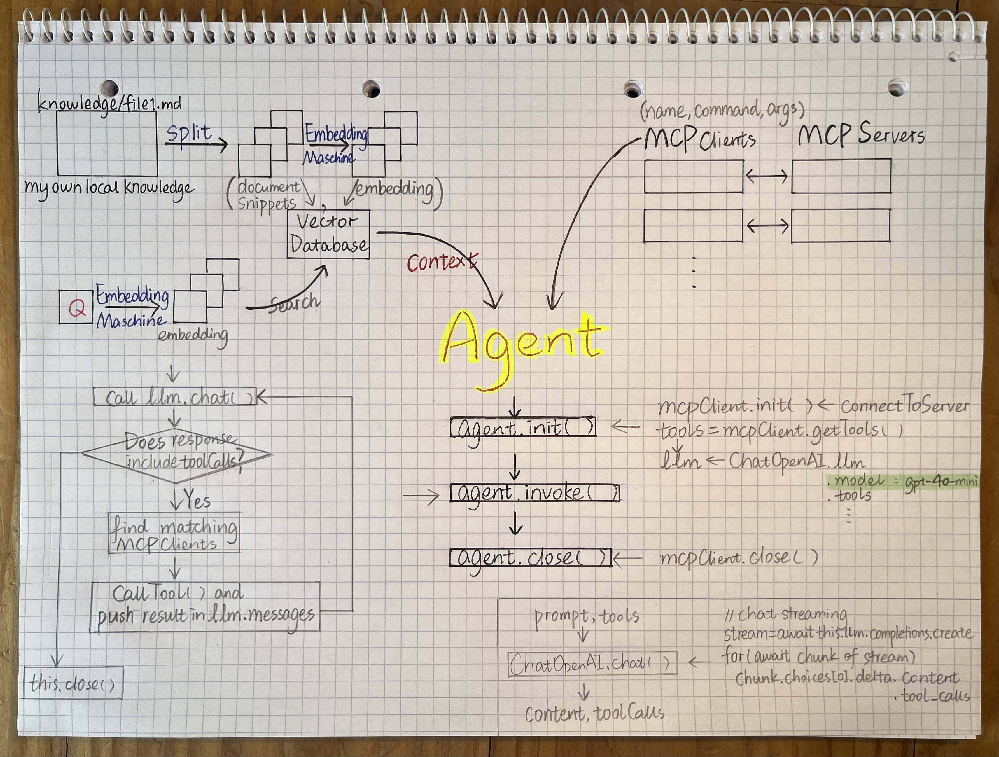
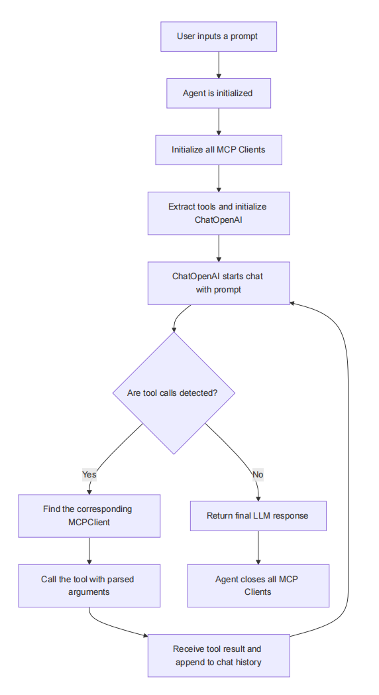

# LLM-MCP-RAG-Agent

## 🚀 Goal

An **augmented LLM agent** that combines:

- OpenAI API (chat model): https://openrouter.ai/openai/gpt-4o-mini  
- Multiple configurable **MCP (Model Context Protocol) Clients**
- Minimal **RAG (Retrieval-Augmented Generation)** support  
- **without relying on any frameworks** like LangChain, LlamaIndex, CrewAI, or AutoGen

## 🧠 Capabilities

- Support **multiple MCP clients** such as:
  - Reading/writing local files
  - Fetching data from internet websites

- **Simplified RAG**:  
  Retrieve relevant content from local files and inject it directly into the prompt context using an EmbeddingModel of Siliconflow  
  🔗 https://cloud.siliconflow.cn/sft-d1mmgckp6kbc738bugig/models?target=BAAI/bge-m3

## 🧭 Example Tasks

- Read a webpage → Summarize → Save to a file  
- Query a local document → Retrieve relevant info → Inject into chat context
- Given your five project experiences, with the prompt being a job description, and the output being the parts of your project experience tailored to match that specific role

- We live in an age of information explosion, where the quality of information varies widely. If you want answers that are accurate and relevant, they can be based on for example: Your own class notes, High-quality resources (website/local files)

## ✍️ Handwritten Notes



## 📊 Flow Chart



## 🛠️ Getting Started

If you want to run this project directly:

```bash
# Add your OpenAI and Siliconflow keys to root/.env file  
# Key request pages:
# - https://openrouter.ai/openai/gpt-4o-mini  
# - https://cloud.siliconflow.cn/sft-d1mmgckp6kbc738bugig/models?target=BAAI/bge-m3

git clone <REPO_URL>
cd llm-mcp-rag-agent
pnpm install
npm add dotenv openai @modelcontextprotocol/sdk chalk
cursor .
pnpm run dev
```

## 🔍 Project References

- [KelvinQiu802/llm-mcp-rag](https://github.com/KelvinQiu802/llm-mcp-rag) – design and structure  
- [StrayDragon/exp-llm-mcp-rag (Python)](https://github.com/StrayDragon/exp-llm-mcp-rag/tree/main) – Python version